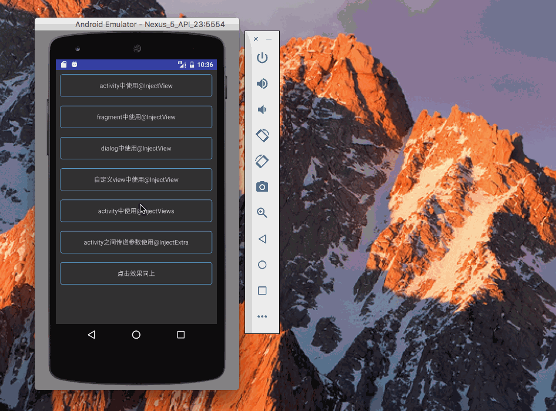

# SAF-Kotlin-InjectView

[](http://www.weibo.com/fengzhizi715)
[](https://www.apache.org/licenses/LICENSE-2.0.html)


# 最新版本：

模块|saf-injectview|saf-injectview-compiler|saf-injectview-annotation
---|:-------------:|:-------------:|:-------------:
最新版本|[](https://bintray.com/fengzhizi715/maven/saf-injectview/_latestVersion)|[](https://bintray.com/fengzhizi715/maven/saf-injectview-compiler/_latestVersion)|[](https://bintray.com/fengzhizi715/maven/saf-injectview-annotation/_latestVersion)


# 下载安装：
在根目录下的build.gradle中添加
```groovy
 buildscript {
     repositories {
         jcenter()
     }
     dependencies {
         classpath 'com.neenbedankt.gradle.plugins:android-apt:1.8'
     }
 }
```
在app 模块目录下的build.gradle中添加

```groovy
apply plugin: 'com.neenbedankt.android-apt'

...

dependencies {
    compile 'com.safframework.injectview:saf-injectview:1.0.0'
    apt 'com.safframework.injectview:saf-injectview-compiler:1.0.0'
    ...
}
```




整个项目的module图：<br>


# 使用方法：
1. @InjectView
---
@InjectView可以简化组件的查找注册，包括android自带的组件和自定义组件。在使用@InjectView之前，我们会这样写代码

```Java
          public class MainActivity extends Activity {

                ImageView imageView;

                @Override
                protected void onCreate(Bundle savedInstanceState) {
                  super.onCreate(savedInstanceState);

                  setContentView(R.layout.activity_main);
                  imageView = (ImageView) findViewById(R.id.imageview);
                }
           }
 ```


在使用@InjectView之后，会这样写代码

```Java
          public class MainActivity extends Activity {

                @InjectView(R.id.imageView)
                ImageView imageView;

                @Override
                protected void onCreate(Bundle savedInstanceState) {
                   super.onCreate(savedInstanceState);

                   setContentView(R.layout.activity_main);
                   Injector.injectInto(this);
                }
          }
```

目前，@InjectView可用于Activity、Dialog、Fragment中。在Activity和Dialog用法相似，在Fragment中用法有一点区别。

```Java
          public class DemoFragment extends Fragment {

                   @InjectView(R.id.title)
                   TextView titleView;

                   @InjectView(R.id.imageview)
                   ImageView imageView;

                   @Override
                   public View onCreateView(LayoutInflater inflater, ViewGroup container, Bundle savedInstanceState) {
                          View v = inflater.inflate(R.layout.fragment_demo, container, false);

                          Injector.injectInto(this,v); // 和Activity使用的区别之处在这里

                          initViews();
                          initData();

                          return v;
                   }

                  ......
           }
```

2. @InjectViews
---

```Java
          public class MainActivity extends Activity {

                @InjectViews(ids={R.id.imageView1,R.id.imageView2})
                ImageView[] imageviews;

                @Override
                protected void onCreate(Bundle savedInstanceState) {
                   super.onCreate(savedInstanceState);

                   setContentView(R.layout.activity_main);
                   Injector.injectInto(this);
                }
          }
 ```


3. @InjectExtra
---

```Java
         /**
          * MainActivity传递数据给SecondActivity
          * Intent i = new Intent(MainActivity.this,SecondActivity.class);                                               
          * i.putExtra("test", "saf");
          * i.putExtra("test_object", hello);
          * startActivity(i);
          * 在SecondActivity可以使用@InjectExtra注解
          *
          * @author Tony Shen
          *
          */
         public class SecondActivity extends Activity{

               @InjectExtra(key="test")
               String testStr;

               @InjectExtra(key="test_object")
               Hello hello;

               protected void onCreate(Bundle savedInstanceState) {
                   super.onCreate(savedInstanceState);

                   Injector.injectInto(this);
                   Log.i("++++++++++++","testStr="+testStr);
                   Log.i("++++++++++++","hello="+SAFUtil.printObject(hello)); // 该方法用于打印对象
              }
          }
```

4. @OnClick
---
@OnClick 可以在Activity、Fragment、Dialog、View中使用，也支持多个组件绑定同一个方法。

```Java
     public class AddCommentFragment extends BaseFragment {

         @Override
         public View onCreateView(LayoutInflater inflater, ViewGroup container,
                             Bundle savedInstanceState) {

             View v = inflater.inflate(R.layout.fragment_add_comment, container, false);

             Injector.injectInto(this, v);

             initView();

             return v;
        }

	    @OnClick(id={R.id.left_menu,R.id.btn_comment_cancel})
	    void clickLeftMenu() {
		    popBackStack();
	    }

	    @OnClick(id=R.id.btn_comment_send)
	    void clickCommentSend() {
            if (StringHelper.isBlank(commentEdit.getText().toString())) {
               ToastUtil.showShort(mContext, R.string.the_comment_need_more_character);
            } else {
               AsyncTaskExecutor.executeAsyncTask(new AddCommentTask(showDialog(mContext)));
            }
	    }

	    ....
    }
```

TODO
===
1. 解决在 ListView 和 RecyclerView 上遇到的问题。

License
-------

    Copyright (C) 2017 Tony Shen.

    Licensed under the Apache License, Version 2.0 (the "License");
    you may not use this file except in compliance with the License.
    You may obtain a copy of the License at

       http://www.apache.org/licenses/LICENSE-2.0

    Unless required by applicable law or agreed to in writing, software
    distributed under the License is distributed on an "AS IS" BASIS,
    WITHOUT WARRANTIES OR CONDITIONS OF ANY KIND, either express or implied.
    See the License for the specific language governing permissions and
    limitations under the License.
